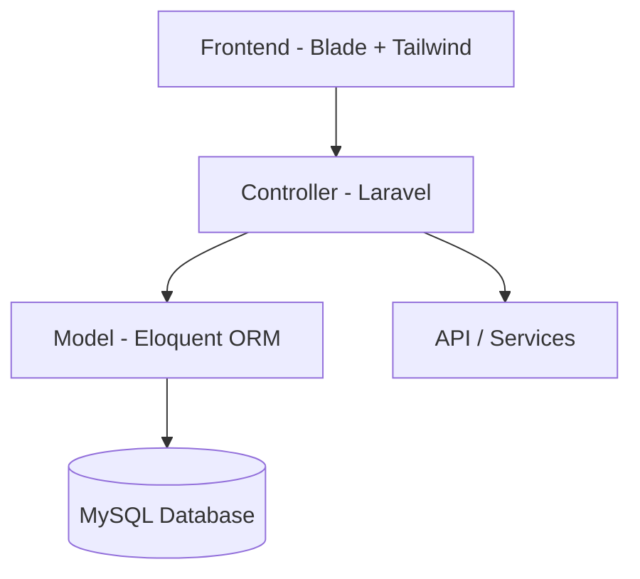

# 📘 Brilian – Scholarship Information Web App

Brilian is a **Laravel-based web application** that centralizes scholarship information from multiple sources (government, universities, private institutions) into one accessible platform.  
With a modern and responsive design, Brilian helps **students, parents, and educators** easily discover scholarship opportunities.

---

## ✨ Features
- 📊 **Dashboard** – Overview of latest, popular, and recommended scholarships  
- 🔍 **Search & Filter** – Search by education level, field of study, provider, country, deadline  
- 📚 **Scholarship Catalog** – Detailed info: description, requirements, deadlines, official links  
- 📌 **Bookmarking** – Save scholarships for later access  
- 📖 **Guides & Tips** – Practical resources (CV writing, motivation letter, recommendation letter, etc.)  
- 📱 **Responsive Design** – Works seamlessly on desktop & mobile  

---

## 🛠️ Tech Stack
- **Backend**: Laravel 10, PHP 8.2  
- **Frontend**: Tailwind CSS  
- **Database**: MySQL  
- **Version Control**: Git & GitHub  
- **Design Tools**: Figma, Canva  

---

## 🚀 Installation

### 1. Clone the Repository
```bash
git clone https://github.com/username/brilian-scholarship-info.git
cd brilian-scholarship-info
```

### 2. Install Dependencies
```bash
composer install
npm install && npm run dev
```

### 3. Environment Setup
```bash
cp .env.example .env
php artisan key:generate
```

Edit `.env` with your database configuration:
```env
DB_CONNECTION=mysql
DB_HOST=127.0.0.1
DB_PORT=3306
DB_DATABASE=brilian
DB_USERNAME=root
DB_PASSWORD=
```

### 4. Run Migrations & Seeders
```bash
php artisan migrate --seed
```

### 5. Start the Application
```bash
php artisan serve
```

App will be available at:  
👉 **http://brilianproject.test**

---

## 📖 Usage
1. Register/Login to access personalized features.  
2. Browse **Dashboard** for the latest & popular scholarships.  
3. Use **Search & Filter** to find scholarships that fit your criteria.  
4. Save scholarships to **Bookmarks**.  
5. Access **Guides & Tips** for application preparation.  

---

## 🏗️ Project Architecture

```
brilian-scholarship-info/
├── app/                # Core logic (Controllers, Models, Middleware)
│   ├── Http/Controllers
│   ├── Models
│   └── Services
├── bootstrap/          # Laravel bootstrap files
├── config/             # Configuration files
├── database/           # Migrations, seeders, factories
├── public/             # Public entry point (index.php, assets)
├── resources/          # Blade views, Tailwind CSS, JS (Vite)
│   ├── views
│   └── css/js
├── routes/             # Web & API routes
├── storage/            # Logs, cache, file storage
├── tests/              # Unit & feature tests
└── vendor/             # Composer dependencies
```

### Flow Diagram


---

## 🤝 Contribution Guide
We welcome contributions!  

1. **Fork** the repository  
2. Create a new **feature branch**  
   ```bash
   git checkout -b feature/new-feature
   ```
3. Commit changes  
   ```bash
   git commit -m "Add new feature"
   ```
4. Push to branch  
   ```bash
   git push origin feature/new-feature
   ```
5. Open a **Pull Request**  

> Follow **PSR-12 coding standards** and include tests where possible.

---

## 📜 License
This project is licensed under the **MIT License** – see the [LICENSE](LICENSE) file for details.  

---

## 👨‍💻 Contributors
- **Bintang Harvindi** – UI/UX Designer  
- **Fidelina Affectine** – Backend & Frontend Developer  
- **Jefferson Weslie** – UI/UX Designer  

---

## 📌 Project Status
🚧 Development in progress  
- 🎨 High Fidelity Design → September 20, 2025  
- 💻 Frontend Development → September 20, 2025  
- ⚙️ Backend Development → October 20, 2025  
- 🤖 AI Agent Integration → November 20, 2025  
